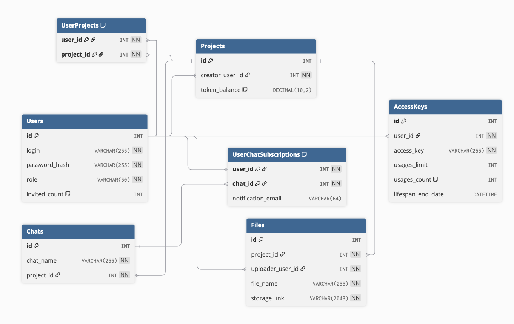

# ИТМО – Высокопроизводительные системы 2025

Групповой проект по дисциплине "Высокопроизводительные системы"

## Предметная область:

Корпоративный чат, организованный в виде проектов с доступом к LLM.

## Выполнили:

Поток ВПС (4к-бак) 1.2

- Ефремов Марк Андреевич
- Агаев Хамза Рустам Оглы
- Галиуллин Рашит Дамирович

## Запуск

Сборка образов и запуск:

```shell
DOCKER_BUILDKIT=1 COMPOSE_DOCKER_CLI_BUILD=1 docker compose build
docker compose up
```

`localhost:8080`

Сброс тома с базой данных:

```shell
docker compose down --volumes
```

## Документация OpenAPI v3

[Swagger UI](http://localhost:8080/swagger-ui.html)

[OpenAPI Specification](http://localhost:8080/v3/api-docs)

## Инфологическая модель



- Пользователи
- Диалоги
- Проекты
- Файлы
- Ключи доступа
- Пользователь-Проект
- Пользователь-Чат (подписка)

## Roadmap

### Лабораторная работа №1

1. Разработать модели и создать миграции для базы данных
   **Модели**

- [x] Пользователи
- [ ] Диалоги
- [ ] Проекты
- [ ] Файлы
- [ ] Ключи доступа

2. CRUD для основных сущностей

- [x] Пользователи
- [ ] Диалоги
- [ ] Проекты
- [ ] Файлы
- [ ] Ключи доступа

3. Провести модульное и интеграционное тестирование (> 70% покрытия)
4. Добавить и развернуть интерактивную документацию
